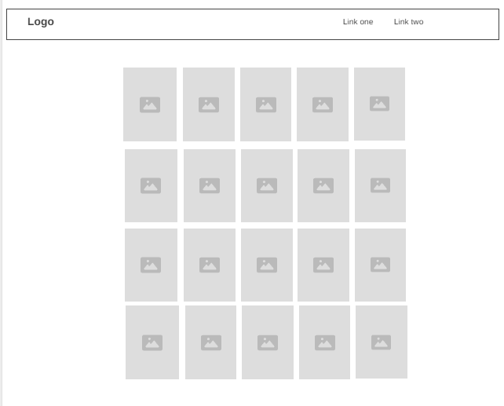

# Fruit Memory Match
A browser memory card game with a searchable leaderboard and resumable games.

## Author
[Nang Khin La Pyae](https://github.com/nangkhinlp)

## User Story
As a casual gamer and a student, 
I want a quick easy game I can pick up inbetween my study breaks or lunch time
So that I can kill time while also practicing my recall and keep my mind fresh and sharp.

## Narrative

**What the app does**
Fruit Memory Match is a 4×5 card-matching game. Players flip cards two at a time to find matching fruit pairs while the game tracks errors, matches, and best scores. A built-in leaderboard records every win, and players can search, sort, and clean up their score history without leaving the game.

**Why I chose it**
I wanted to make this project more well-rounded.

**What I improved**
- Removed the hardcoded fruit array and put the data into an external JSON file fetched via the Fetch API
- Added a leaderboard with live search and multi-criteria sort
- Added a resumable game state — refreshing the tab restores the board exactly where the player left off
- Added Bootstrap modal for the Leaderboard
- Used `@import` to integrate Normalize.css for cross-browser consistency

**Development**
The biggest hurdle was getting fetch and ES modules to play nicely together. Top-level `await` looks simple but the export bindings tripped me up — reassigning `fruits = data.fruits` inside the async function didn't propagate to the import, but `fruits.push(...)` did. Once that clicked, the rest fell into place. 
- Storing just `errors` and `matches` in sessionStorage wasn't enough to actually resume a game — I needed the full board layout and a list of matched positions, which led to a `getCurrentState()` helper that snapshots the live game.

## Project Structure
│   index.html
│   README.md
│
├───data
│       data.json
│
├───images
│       back.jpg
│       banana.jpg
│       cherry.jpg
│       fig.jpg
│       grapes.jpg
│       orange.jpg
│       papaya.jpg
│       pear.jpg
│       pineapple.jpg
│       raspberry.jpg
│       strawberry.jpg
│       wireframe.png
│
├───scripts
│       data.js
│       game.js
│       leaderboard.js
│       storage.js
│
└───styles
        game.css

## Game Objective

Flip cards two at a time to find matching fruit pairs. Match all 10 pairs
in as few errors as possible. Your best score is saved between sessions.

## Rules

1. Cards are shown face-up briefly at the start — memorize them!
2. Click any card to flip it over.
3. Click a second card to try and find its match.
4. Matched pairs stay face-up. Mismatches flip back over.
5. Win by matching all 10 pairs.

## Wireframe



## Tech Used

- HTML5 (semantic landmarks)
- Bootstrap 5 (Navbar, Modal)
- CSS3 (custom properties, Grid/Flex, Google Fonts, animations)
- JavaScript ES Modules (`import` / `export`)
- Web Storage API (`localStorage`)
- Fetch API

## Resources

- [Bootstrap 5](https://getbootstrap.com/docs/5.3/)
- [Normalize.css](https://necolas.github.io/normalize.css/)
- [MDN ES Modules](https://developer.mozilla.org/en-US/docs/Web/JavaScript/Guide/Modules)
- [MDN localStorage](https://developer.mozilla.org/en-US/docs/Web/API/Window/localStorage)
- [MDN Fetch API](https://developer.mozilla.org/en-US/docs/Web/API/Fetch_API)
- [Google Fonts — Nunito](https://fonts.google.com/specimen/Nunito)
- [Constraint Validation API](https://developer.mozilla.org/en-US/docs/Web/API/Constraint_validation)
- [Nu HTML Validator](https://validator.w3.org/nu/)
- [WAVE Accessibility Checker](https://wave.webaim.org/)

## Code Highlight

### Shuffle algorithm

```js
function shuffleCards() {
    cardSet = cardList.concat(cardList);
    for (let i = 0; i < cardSet.length; i++) {
        const j = Math.floor(Math.random() * cardSet.length);

        let temp    = cardSet[i];
        cardSet[i]  = cardSet[j];
        cardSet[j]  = temp;
    }
}
```

doubles the list
loop through the list
get random index
and swap the cards 

### handleWin() algorithm
```js
function handleWin() {
    const current = loadHighScore();

    if (current === 0 || errors < current) {
        saveHighScore(errors);
        document.getElementById("high-score").innerText = errors;
    }

    const scoreRecord = {
        player: loadPlayerName() || "Anonymous",
        errors: errors,
        matches: matches,
    };
    console.log("New score record:", JSON.stringify(scoreRecord, null, 2));
    saveScore(scoreRecord);

    clearProgress();
    setTimeout(() => alert(`You won! Finished with ${errors} error(s).`), 300);
}
```
Player wins -> updates all-time high score
builds a JSON record of the score
prints it to console for debugging
saves to leaderboard

## Future Improvements
- Difficulty Levels with Timer
- Custom Themes and Decks
- Track time for a player's game win. Could be another stat for the leaderboard

## Validation

- [Nu Validator — Live Page](https://validator.w3.org/nu/?doc=https%3A%2F%2Fnangkhinlp.github.io%2Ffruit-memory-match%2F)
- [WAVE Checker — Live Page](https://wave.webaim.org/report#/https://nangkhinlp.github.io/fruit-memory-match/)
